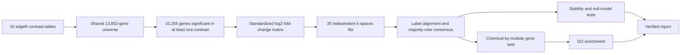

# PFAS toxicogenomics with consensus k-spaces

[](https://github.com/VijayChamakuri/pfas-toxicogenomics-kspaces/actions/workflows/integrated-pfas-ci.yml)
[](LICENSE)
[](https://www.python.org/)
[](#scope-and-limitations)

A reproducible cross-chemical analysis of precomputed edgeR contrasts from ten PFAS exposures in
*Caenorhabditis elegans*. It resolves shared and chemical-associated transcriptional responses into
consensus gene modules, tests their stability, and connects them to Gene Ontology (GO) functions.

> **Primary artifact:**
> [`PFAS_master_analysis.ipynb`](K-spaces%20Analysis/PFAS_master_analysis.ipynb) is the executed,
> single-file scientific report. It contains the complete narrative, code, tables, figures, and
> validation outputs.

**Navigate:** [Key findings](#key-findings) · [Results](#results-gallery) ·
[Scientific correction](#scientific-correction) · [Reproduce](#reproduce-the-analysis) ·
[Limitations](#scope-and-limitations) · [Provenance](#data-and-software-provenance) ·
[Citation](#citation)


## Research question

PFAS are often evaluated one chemical at a time, although related compounds may perturb shared
biological programs. This project asks whether transcriptional responses across structurally diverse
PFAS exposures can be organized into reproducible modules that support group-based toxicological
reasoning.

The conclusion is intentionally cautious. Five modules are computationally stable, but a previous
chemical-pair similarity result did not survive an appropriate null test. That result is withdrawn
and preserved here as an auditable scientific correction.

## Study at a glance

| Item | Value |
|---|---|
| Organism | *C. elegans* |
| Exposure panel | PFOSA, PFBSA, PFOS, PFNA, PFOA, GenX, PFEESA, PFBS, PFPeA, PFBA |
| Design | Each chemical compared with its control at its experiment-specific EC50 |
| Measured universe | 13,852 genes shared by all ten contrasts |
| Clustered universe | 10,255 genes with false discovery rate (FDR) below 0.05 in at least one contrast |
| Primary signal | Continuous log2 fold change, row standardized across chemicals |
| Recommended model | k=5 consensus from 30 independently seeded and label-aligned fits |
| Functional analysis | GO Biological Process, Molecular Function, and Cellular Component |
| Reproducibility | Fixed seed, pinned scientific requirements, documented engineering environments, input hashes, tests, CI, and an executed notebook |

EC50 is the concentration associated with a 50% effect in the experimental assay. Signed percentile
ranks and top-N selections are sensitivity analyses. Detection thresholds do not replace continuous
effects in the primary matrix.

## Key findings

- **Response magnitude varied substantially.** PFOSA produced 9,161 detected differentially
  expressed genes (DEGs), followed by PFPeA with 5,997 and PFBSA with 2,601. PFOA produced the
  smallest detected response, with 154 genes.
  [Evidence: DEG counts](K-spaces%20Analysis/output/deg_counts.csv)
- **Five modules summarize the clustered response.** Modules 0 through 4 contain 1,915, 1,496,
  2,386, 2,944, and 1,514 genes, respectively.
  [Evidence: assignments](K-spaces%20Analysis/output/kspaces_runs/primary_k5_consensus_module_assignments.csv)
- **Optimizer agreement is high.** Mean per-gene consensus strength is 0.951, and 91.4% of genes
  have at least 0.8 agreement across 30 fits. This measures computational agreement, not biological
  replication.
  [Evidence: consensus strength](K-spaces%20Analysis/output/kspaces_runs/primary_k5_consensus_strength.csv)
- **PFOSA has the greatest influence on the solution.** Removing PFOSA gives an adjusted Rand index
  (ARI) of 0.547 against the full consensus. The other leave-one-chemical-out ARIs range from 0.766
  to 0.886.
  [Evidence: jackknife analysis](K-spaces%20Analysis/output/kspaces_runs/chemical_jackknife.csv)
- **No chemical pair remains significant after correction.** None of 45 pairwise tests passes the
  Benjamini-Hochberg (BH) adjusted q-value threshold of 0.05 at k=5 or k=10.
  [Evidence: k=5 tests](K-spaces%20Analysis/output/kspaces_runs/residual_metric_k5_corr_vs_null.csv) ·
  [k=10 tests](K-spaces%20Analysis/output/kspaces_runs/residual_metric_k10_corr_vs_null.csv)
- **GO enrichment identifies interpretable functional themes.** The displayed consensus results
  contain 216 family-wide significant module-term records. Prominent Biological Process themes
  include autophagy, RNA and nucleic-acid metabolism, translation, xenobiotic metabolism, cilium
  organization, and innate immune or defense responses.
  [Evidence: GO enrichment](K-spaces%20Analysis/output/kspaces_runs/go_enrichment/consensus_k5_GO_enrichment.csv)

These findings are descriptive and exploratory. They do not establish causal mechanisms, human
health effects, regulatory groups, or superiority of the k-spaces framework.

## Analysis workflow



## Results gallery

### Exact cross-chemical DEG intersections

The response is dominated by a small number of large intersection patterns, while many exact
patterns contain fewer genes. The plot shows the 30 largest patterns; complete unsigned,
upregulated, and downregulated tables are in
[`output/deep_analysis`](K-spaces%20Analysis/output/deep_analysis/).


### Response scale and sharing

The total detected response differs sharply among chemicals. The shared and exclusive portions
should therefore be interpreted alongside each chemical's overall DEG count.


### Consensus module activity

The modules show distinct condition-level activity profiles. The ten conditions are the observations
in the principal component analysis; genes are not treated as independent chemical replicates.


### Chemical-by-module functional depth

GO yield varies by chemical and module, partly reflecting gene-set size and annotation coverage.
All 50 gene sets are exported, and testing records every eligible or skipped study across three GO
namespaces with one BH correction per declared family.


### Ontology-backed interpretation

The panels use GO parent relationships instead of manually constructed pathway trees. They summarize
enriched terms without converting enrichment into evidence of causation.


More figures, including signed UpSet plots, chemical-module preference, per-module contribution,
ontology panels, and Sankey summaries, are available in
[`output/figures/deep_analysis`](K-spaces%20Analysis/output/figures/deep_analysis/).

## Scientific correction

The original analysis correlated five-element module-percentage profiles between chemicals. A
label-null stress test showed that uneven module sizes can create high correlations without
biological structure. The corrected analysis subtracts module-size expectation and applies empirical
pairwise tests with BH correction across all 45 pairs, separately at k=5 and k=10. No pair remains
significant at either resolution.

The repository does not promote the earlier unadjusted rankings, the GenX-PFBS emphasis, or the
proposed chain-length structure-activity claim. Reactome findings are not reconstructed because a
pinned gene-set release and reproducible historical result table were unavailable.

This correction is a central result. It shows why apparent structure in a low-dimensional summary
must be tested against an appropriate null before receiving a biological interpretation.

## View the results

No installation is required to inspect the completed work:

1. Open the executed [`master notebook`](K-spaces%20Analysis/PFAS_master_analysis.ipynb).
2. Read the concise [`findings summary`](K-spaces%20Analysis/FINDINGS.md).
3. Browse the [`final figures`](K-spaces%20Analysis/output/figures/) and
   [`result tables`](K-spaces%20Analysis/output/).

## Reproduce the analysis

Python 3.13 is recommended.

```bash
git clone https://github.com/VijayChamakuri/pfas-toxicogenomics-kspaces.git
cd pfas-toxicogenomics-kspaces

python3.13 -m venv "K-spaces Analysis/.venv"
"K-spaces Analysis/.venv/bin/pip" install -r "K-spaces Analysis/requirements.txt"
"K-spaces Analysis/.venv/bin/pip" install nbformat nbconvert jupyterlab ipykernel pytest
"K-spaces Analysis/.venv/bin/python" -m ipykernel install --user \
  --name kspaces_venv --display-name "Python (PFAS k-spaces)"
"K-spaces Analysis/.venv/bin/python" "K-spaces Analysis/scripts/prepare_annotations.py"

cd "K-spaces Analysis"
.venv/bin/python build_master_notebook.py
.venv/bin/jupyter nbconvert --to notebook --execute --inplace \
  --ExecutePreprocessor.timeout=5400 \
  --ExecutePreprocessor.kernel_name=kspaces_venv \
  PFAS_master_analysis.ipynb
```

Do not edit the generated notebook directly. Update the builder, regenerate, and execute it. The
full run took approximately 15 to 20 minutes on the development machine; runtime varies by hardware
and numerical libraries.

## Verify the repository

```bash
"K-spaces Analysis/.venv/bin/python" -m pytest -q "K-spaces Analysis/tests"
(cd integrated_system && .venv/bin/ruff check .)
(cd integrated_system && .venv/bin/mypy src/pfas_workflow llm_system)
(cd integrated_system && .venv/bin/pytest -q)
```

Release verification completed with 56 of 56 notebook code cells executed without errors,
10 scientific tests passed, 35 integrated-system tests passed, and successful lint, typing, ML
backend, container-health, and Terraform checks. See the
[GitHub Actions workflow](https://github.com/VijayChamakuri/pfas-toxicogenomics-kspaces/actions/workflows/integrated-pfas-ci.yml).

## Optional research-software extensions

The [`integrated_system`](integrated_system/) demonstrates typed workflow planning, evidence-grounded
retrieval, PyTorch and TensorFlow parity checks, Docker packaging, CI/CD, and an approval-gated AWS
Terraform starter. These components are intentionally separate from the scientific analysis.

The ML models use an 80-record synthetic workflow-request dataset. Their scores test software
behavior only and are not PFAS prediction results. Retrieval-augmented generation (RAG) can retrieve
reviewed local evidence, but it cannot execute or overrule the scientific analysis. Fine-tuning is
limited to a synthetic request router. No live cloud deployment is claimed.

Setup and usage are documented in the
[`engineering README`](integrated_system/README.md).

## Repository map

```text
.
├── Data/DEGs/                         # Ten approved edgeR contrast tables
├── K-spaces Analysis/
│   ├── PFAS_master_analysis.ipynb     # Executed single-file report
│   ├── build_master_notebook.py       # Public notebook builder
│   ├── build_notebook.py              # Canonical analysis cell source
│   ├── src/pfas_master/               # Tested scientific helpers
│   ├── tests/                         # Scientific invariants and QA
│   ├── data_external/                 # Frozen GO and WormBase snapshots
│   └── output/                        # Tables, gene lists, figures, and PDFs
├── integrated_system/                 # Optional software and ML extensions
└── .github/workflows/                 # Automated verification
```

## Scope and limitations

- Raw RNA-seq counts, complete sample metadata, and sequencing quality control are not included.
  The upstream edgeR analysis cannot be independently reconstructed from this repository.
- GenX used a different vehicle or control, which confounds direct cross-chemical interpretation.
- Each chemical was studied at its own EC50, so results do not represent a common external dose.
- The study does not include dose-response or time-course analysis.
- k=5 is a pragmatic resolution and stability recommendation, not a uniquely proven model.
- Consensus strength measures computational agreement, not biological reproducibility.
- GO p-values do not propagate annotation incompleteness or module-assignment uncertainty.
- No external dataset validates the modules or functional themes.
- Findings must not be interpreted as causal mechanisms or direct evidence for human regulation.

Read [`FINDINGS.md`](K-spaces%20Analysis/FINDINGS.md), the
[`scientific audit`](integrated_system/docs/SCIENTIFIC_AUDIT.md), and the
[`data-use statement`](integrated_system/docs/DATA_USE.md) before citing results.

## Data and software provenance

The approved DGE tables, GO snapshot, WormBase annotation snapshot, versions, checksums, and
third-party terms are documented in [`DATA_SOURCES.md`](DATA_SOURCES.md). GO data are redistributed
under CC BY 4.0. Original project code is MIT licensed. The k-spaces package is distributed under a
BSD 2-Clause license.

## Citation

Use [`CITATION.cff`](CITATION.cff) to cite this repository. The clustering method is based on:

> Markarian N, Engelhardt BE, Pierce NA, Sternberg PW, Pachter L. *k-spaces: Mixtures of Gaussian
> latent variable models*. bioRxiv. 2025. doi:10.1101/2025.11.24.690254.

When using the ontology or annotations, cite the Gene Ontology Consortium and report the data
release recorded in [`DATA_SOURCES.md`](DATA_SOURCES.md).

## Contributing, security, and license

- Contribution guidance: [`CONTRIBUTING.md`](CONTRIBUTING.md)
- Security and responsible disclosure: [`SECURITY.md`](SECURITY.md)
- License: [MIT](LICENSE)

Vendored ontology and annotation data retain their upstream terms as documented in
[`DATA_SOURCES.md`](DATA_SOURCES.md).
